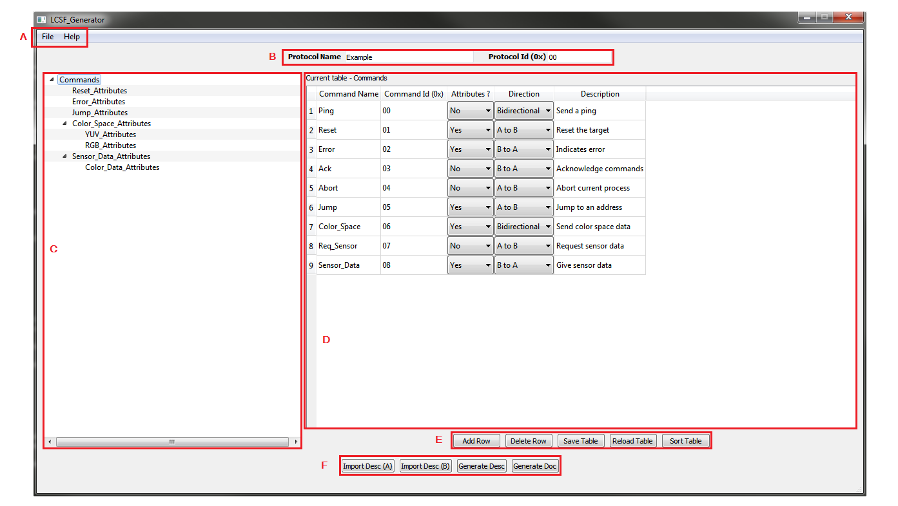
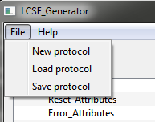
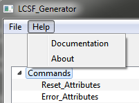

## What is LCSF Generator

LCSF Generator is a C++/Qt graphical tool that will allow you to:
1. Create and edit protocols based on [LCSF](https://jean-roland.github.io/LCSF_Doc/) easily.
2. Generate corresponding code for the [LCSF C Stack](https://github.com/jean-roland/LCSF_C_Stack) and [LCSF Stack Rust](https://github.com/jean-roland/LCSF_Stack_Rust).
3. Import previous protocol source files to deploy modificatons without hassle (only C files supported).
4. Generate protocole documentation on wiki and markdown format.

## Interface Breakdown

The LCSF Generator GUI is detailed below:

### A - Menu Bar

The menu bar is composed of the file menu and the help menu.

#### File Menu

The file menu structure is:

* New Protocol: Clear the interface to easily start a new protocol.
* Load protocol: Open a file dialog to load a saved protocol.
* Save protocol: Open a file dialog to save the current protocol (json format).

#### Help Menu

The help menu structure is:

* Documentation: Open a navigator window to this ressource.
* About: Show the software version and a licence abstract.

### B - Protocol Section

This is where you fill the protocol parameters:
* Protocol Name: The protocol name that will be used in files, code and documentation (Up to 64 alphanumerical characters and underscore allowed).
* Protocol Id: The id that will be used in the LCSF stacks to identify the protocol (Up to 4 hexadecimal characters allowed).

### C - Table Tree

This component will show hierarchically the different tables that make the protocol.

Clicking on a table will display the table content on the table view (section D).
It will also silently save any modifications on the previous table.

The root table is always the Commands table and will contain the protocol commands.
Each root table child will be a command containing attributes.
Each command table child will be an attribute containing sub-attributes and so on and so forth.

### D - Table View

The table view will display the content of the currently selected table on the table tree (section C).
The label on top indicates which table is currently displayed.

If the root table Commands is selected, it will display the protocol command table, otherwise it will display an attribute table.

Each table is composed of 5 columns, which depend on the table type. Each row represents an entry in the table.
Each cell of the table can be modified directly, only the first two columns (name, id) are mandatory.

If the table detects two identitcal ids it will disable the save table button and highlight the cells in red.

#### Command Table

The command table is composed of 5 columns:
* Command Name: The name of the command that will be used in code and documentation (Up to 64 alphanumerical characters and underscore allowed).
* Command Id: The id that will be used in the LCSF stacks to identify the command (Up to 4 hexadecimal characters allowed, will be interpreted as 0 otherwise).
* Attributes ?: Does the command have attributes or not (Yes or no choice).
* Direction: Set the command direction (See the LCSF Documentation for more details).
* Description: The command description that will be used in documentation.

#### Attribute Table

The attribute table is composed of 5 columns:
* Attribute Name: The name of the attribute that will be used in code and documentation (Up to 64 alphanumerical characters and underscore allowed).
* Attribute Id: The id that will be used in the LCSF stacks to identify the attribute (Up to 4 hexadecimal characters allowed, will be interpreted as 0 otherwise).
* Optional ?: Is the attribute optional or not (Yes or no choice).
* Data Type: Set the attribute data type (See the LCSF Documentation for more details).
* Description: The attribute description that will be used in documentation.

### E - Table Button

Table buttons have an effect on the table view (section D). It contains 5 buttons:
* Add Row: Add a new empty row at the end of the current table.
* Delete Row: Delete the currently selected row (the last one by default), modifications will be immediately saved. 
* Save Table: Save modifications of the current table, will only take into account valid rows (name and ids are valid).
* Reload Table: Reload the current table and cancel unsaved modifications.
* Sort Table: Sort the table by id ascending order, will also refresh the tree if needed.

### F - Output Button

Output buttons are related to code and documentation generation. It contains 4 buttons:
* Import Desc (A): Import previous code of the protocol A point of view (see LCSF directions), it will change the A output directory to the imported code location. Will turn green after import.
* Import Desc (B): Import previous code of the protocol B point of view (see LCSF directions), it will change the B output directory to the imported code location. Will turn green after import.
* Generate Desc: Generate protocol code for the LCSF stacks, it will generate code for both A and B point of views.
* Generate Doc: Generate protocol documentation, it will produce wiki and markdown format of the protocol command and attribute tables. 

### Tooltip

In case you forgot the purpose on an element of the GUI, most of them have a tooltip that might help you.
Just hover your mouse over them for a couple of seconds to make them appear.

## How to use it

1. (optional) Load protocol description.
2. Set/Modify protocol name and protocol id.
3. Add/Modify protocol commands in the root table.
4. Add/Modify attributes and sub-attributes in the sub-tables.
5. Save the description for future use.
6. (optional) Import previous code if you already wrote specific code in the protocol main source file.
7. Generate source code and documentation.

## About Code Generation

LCSF Generator will generate code for the LCSF stacks following the protocol description.
It will generate code for both A and B points of view.

It will fully generate the descriptor and bridge files but only build a template for the main files as it cannot produce application code.

If you already wrote application code for the protocol, you can import it through the _Import Desc_ buttons, the code will be included in the next generation. It will only accept files named "protocolName_Main.c".

## About Code Importation

The code importation feature relies heavily on its internal model of a protocol main source file to extract useful information. This means that heavy modification of this file formatting (sections names mainly) might yield unpredicted behaviour when importing and generating code with it.
